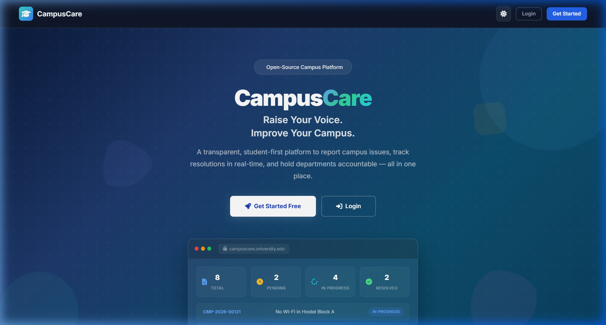
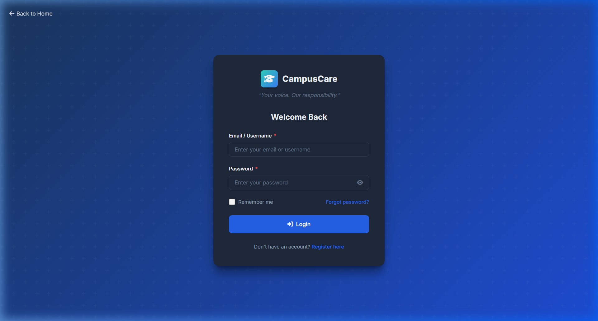
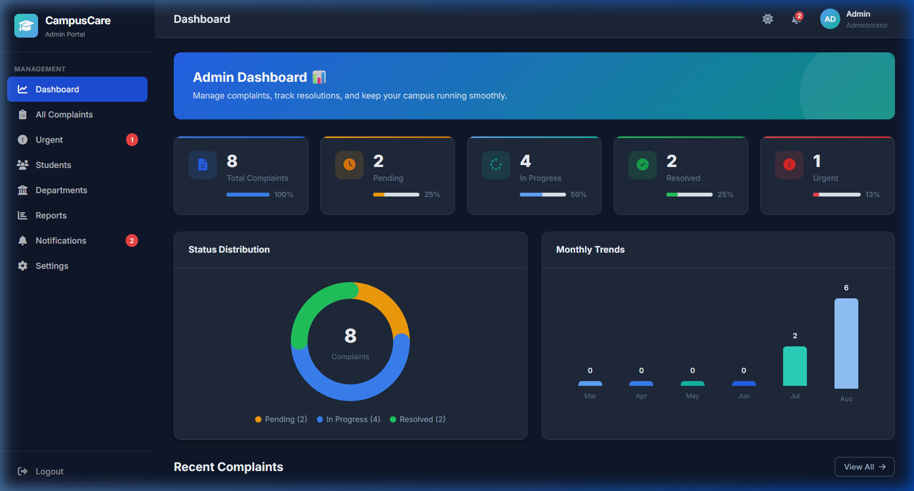
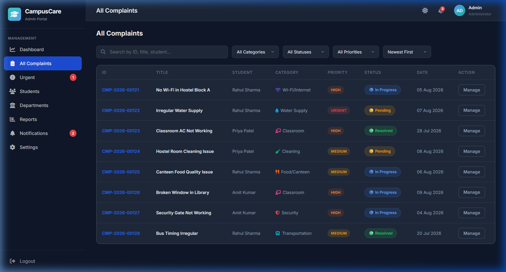
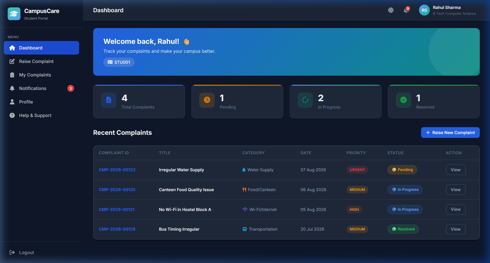
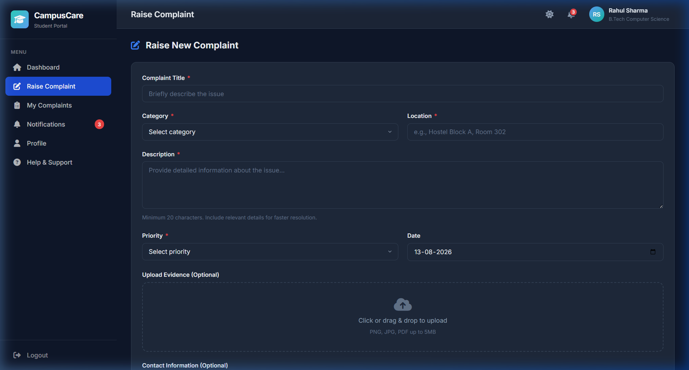

<p align="center">
  
</p>

<h1 align="center">🎓 CampusCare</h1>
<h3 align="center">University Complaint Portal — Your Voice. Our Responsibility.</h3>

<p align="center">
  <a href="https://campus-care-umber-six.vercel.app/"></a>
  <a href="#-key-features"></a>
  <a href="#-technology-stack"></a>
  <a href="#-getting-started"></a>
  <a href="#-license"></a>
</p>

<p align="center">
  <b>CampusCare</b> is a modern, responsive, SaaS-style Single Page Application (SPA) designed for universities and colleges to streamline student complaint submission, real-time status tracking, and administrative resolution workflows — all from a beautiful, dark-themed UI.
  <br/><br/>
  🚀 <b><a href="https://campus-care-umber-six.vercel.app/">Try the Live Demo</a></b>
</p>

---

## 📸 Screenshots

<table>
  <tr>
    <td align="center"><b>🏠 Landing Page</b></td>
    <td align="center"><b>🔐 Login Page</b></td>
  </tr>
  <tr>
    <td></td>
    <td></td>
  </tr>
  <tr>
    <td align="center"><b>📊 Admin Dashboard</b></td>
    <td align="center"><b>📋 Admin Complaints</b></td>
  </tr>
  <tr>
    <td></td>
    <td></td>
  </tr>
  <tr>
    <td align="center"><b>🎓 Student Dashboard</b></td>
    <td align="center"><b>📝 Raise Complaint</b></td>
  </tr>
  <tr>
    <td></td>
    <td></td>
  </tr>
</table>

---

## ✨ Key Features

### 🏠 Landing Page
| Feature | Description |
|---------|-------------|
| **Animated Hero Section** | Gradient titles, floating geometric shapes, and particle grid background |
| **Glassmorphic Dashboard Mockup** | Interactive preview of the admin panel with blur effects |
| **Live Platform Stats** | Real-time counters from actual system data (complaints, resolved, categories) |
| **How It Works** | Animated step-by-step process with connector lines |
| **Complaint Categories** | Visual grid showcasing all 10+ complaint categories |
| **Why CampusCare** | Feature highlights with animated cards |
| **Scroll Reveal Animations** | Elements fade in on scroll using IntersectionObserver |
| **🌓 Light / Dark Mode** | Theme toggle on the landing page navbar |

---

### 👨‍🎓 Student Portal

| Feature | Description |
|---------|-------------|
| **Interactive Dashboard** | Welcome banner, quick stats cards, and recent complaints overview |
| **Raise Complaint** | Full form with category, location, priority, date, file upload, and contact info |
| **Auto-Generated IDs** | Instant complaint ID in format `CMP-YYYY-NNNNN` |
| **My Complaints** | Search, filter (category/status/priority), and sort (newest, oldest, priority) |
| **Visual Timeline** | Multi-step status tracker: `Submitted → Reviewed → Assigned → In Progress → Resolved` |
| **Feedback System** | ⭐ Star rating + written review for resolved complaints |
| **Notifications** | Real-time badge alerts for status changes and department assignments |
| **Profile Management** | Edit name, course, year, phone, and change password |
| **Help & Support** | FAQ section, complaint guidelines, and campus contact directory |

---

### 🛡️ Admin Portal

| Feature | Description |
|---------|-------------|
| **Admin Dashboard** | Overview stats, donut chart (status distribution), bar chart (monthly trends) |
| **All Complaints** | Filterable & sortable table with status badges and quick actions |
| **Complaint Management** | Change status, assign department, alter priority, add notes, write resolution |
| **Urgent Monitor** | Dedicated view for critical/high-priority pending issues |
| **Departments** | Directory of all campus departments with resolution metrics |
| **Students** | Student directory with complaint statistics |
| **Analytics & Reports** | Visual reports by status, category, monthly trends, and department resolution rates |
| **Settings** | Theme toggle (Light/Dark), notification preferences, data reset |

---

## 🔐 Authentication

CampusCare uses a secure, role-based authentication system:

### 🛡️ Admin Login

<details>
<summary>🔑 View Admin Credentials</summary>

| Field | Value |
|-------|-------|
| **Username** | `admin` |
| **Password** | `Spsu@2011` |

</details>

### 🎓 Student Login
Students register their own accounts via the **Register** page. Fill in:
- Full Name, Student ID, Email, Password
- Phone, Course, Year (optional)

> **Note**: No demo/fake credentials are used. Students must register to access the portal.

### Authentication Features
- ✅ Role-based access control (Student vs Admin routes)
- ✅ Route guards — unauthorized access redirects to login
- ✅ Session persistence via localStorage
- ✅ Password visibility toggle
- ✅ Profile editing with password change support

---

## 🎨 Design System

| Element | Details |
|---------|---------|
| **Theme** | Dark mode (default) + Light mode with CSS custom properties |
| **Colors** | Deep Blue `#1a365d` · Teal `#0d9488` · Green `#22c55e` · Amber `#f59e0b` · Red `#ef4444` |
| **Typography** | [Inter](https://fonts.google.com/specimen/Inter) via Google Fonts |
| **Icons** | [Font Awesome 6](https://fontawesome.com/) |
| **Layout** | Sidebar + Header (desktop) · Collapsible drawer (mobile/tablet) |
| **Animations** | CSS transitions, scroll-reveal, floating shapes, gradient animations |
| **Charts** | Pure CSS/SVG donut charts and bar charts (zero dependencies) |

---

## 🛠️ Technology Stack

| Layer | Technology |
|-------|------------|
| **Structure** | HTML5 (Semantic) |
| **Styling** | Vanilla CSS3 (Custom Properties, Grid, Flexbox, Animations) |
| **Logic** | JavaScript ES6+ (Modules, Classes, IntersectionObserver) |
| **Architecture** | Single Page Application with Hash-based Routing |
| **Data Layer** | Web Storage API (`localStorage`) with auto-migration versioning |
| **Icons** | Font Awesome 6 CDN |
| **Fonts** | Google Fonts (Inter) |
| **Hosting** | Any static server (no build step required) |

> **Zero dependencies. No frameworks. No build tools. Just open and run.**

---

## 🚀 Getting Started

### Prerequisites
- Any modern web browser (Chrome, Firefox, Edge, Safari)
- (Optional) A static file server for local development

### Installation

```bash
# 1. Clone the repository
git clone https://github.com/shrutiyadav-ai/CampusCare.git

# 2. Navigate to the project
cd CampusCare

# 3. Open in browser (choose one)
# Option A: Direct file open
start index.html          # Windows
open index.html           # macOS
xdg-open index.html       # Linux

# Option B: Local server (recommended)
npx http-server -p 8080   # Node.js
python -m http.server 8080 # Python
```

Then visit **http://localhost:8080** in your browser.

Or skip the local setup and explore the **[Live Demo on Vercel](https://campus-care-umber-six.vercel.app/)**.

---

## 📁 Project Structure

```
CampusCare/
├── 📄 index.html              # SPA entry point & HTML shell
├── 📄 README.md               # This documentation
│
├── 🎨 css/
│   └── style.css              # Complete design system & component styles
│                                 (3000+ lines: tokens, layouts, animations)
│
├── ⚙️ js/
│   ├── app.js                 # Router, initialization & event delegation
│   ├── auth.js                # Authentication & session management
│   ├── complaints.js          # Complaint CRUD, filters & search logic
│   ├── admin.js               # Admin actions & data aggregations
│   ├── notifications.js       # Notification engine
│   ├── charts.js              # Pure CSS/SVG chart renderers
│   ├── data.js                # Data storage, seeding & auto-migration
│   ├── utils.js               # Toasts, modals, validation & formatting
│   └── views.js               # All component views & HTML templates
│
└── 📸 screenshots/            # App screenshots for README
    ├── landing-hero.png
    ├── landing-features.png
    ├── login-page.png
    ├── admin-dashboard.png
    ├── admin-complaints.png
    ├── student-dashboard.png
    └── raise-complaint.png
```

---

## 🔄 Data Management

CampusCare uses `localStorage` for offline-first data persistence:

- **Auto-Seeding**: Sample complaints and departments are pre-loaded on first visit
- **Version Migration**: Data schema versioning ensures smooth upgrades — old credentials are automatically replaced when a new version is deployed
- **Reset Option**: Admins can reset all data from `Settings → Data Management → Reset`

---

## 🤝 Contributing

Contributions are welcome! Here's how:

1. **Fork** the repository
2. **Create** a feature branch: `git checkout -b feature/amazing-feature`
3. **Commit** your changes: `git commit -m 'Add amazing feature'`
4. **Push** to the branch: `git push origin feature/amazing-feature`
5. **Open** a Pull Request

---

## 📜 License

This project is licensed under the **MIT License** — see the [LICENSE](LICENSE) file for details.

---

<p align="center">
  Made with ❤️ for better campus life<br/>
  <b>CampusCare</b> © 2026
</p>
